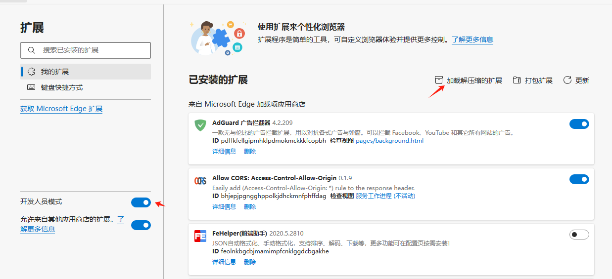

# zStart

一个简洁起始页（新标签页），基于Vue3 in Vite的Edge/Chrome浏览器插件


### 部署

- **安装** [node.js](https://nodejs.org/zh-cn/) **环境**

  > node > 16.16.0  
  > npm > 8.15.0

- 然后以 **管理员权限** 运行 `cmd` 终端，并 `cd` 到 项目根目录
- 在 `终端` 中输入：

  ```bash
  # 安装 pnpm
  npm install -g pnpm

  # 安装依赖
  pnpm install

  # 开发
  pnpm dev

  # 构建
  pnpm build
  ```

### 加载

以Edge浏览器为例，在 `浏览器设置` 中找到 `扩展程序`，然后点击 `加载已解压的扩展程序`，选择 `dist` 文件夹，即可加载

